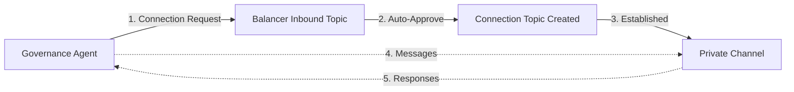

# 🦌⚡ Lynx Balancer Agent

**Pure Agent-Driven Treasury Rebalancing** - An intelligent AI agent that autonomously manages tokenized index fund treasuries using Hedera blockchain tools with complete transparency and step-by-step decision-making.

## 🎯 Overview

The Lynx Balancer Agent takes a **pure agentic approach** to treasury management - no complex parsing, no rigid JSON structures, just intelligent reasoning. The agent fetches real blockchain data, performs calculations transparently, and executes rebalancing operations with full visibility into its decision-making process.

### 🚀 **Pure Agent Approach - What Makes This Special**

Instead of traditional rule-based systems, this agent:
- **🧠 Reasons through problems** like a human treasury manager
- **📊 Shows its work step-by-step** with detailed calculations  
- **🔍 Fetches real-time data** directly from blockchain tools
- **⚖️ Makes intelligent decisions** based on current vs target ratios
- **💬 Explains everything** in plain English with full transparency

### Key Features

- ✅ **Transparent Calculations**: See every step of the agent's math and reasoning
- ✅ **Pure Agent Intelligence**: No parsing or rigid structures - agent handles everything
- ✅ **Real-time Data**: Fetches live contract ratios and token supplies from blockchain
- ✅ **Cost-Efficient**: Uses GPT-4o-mini for production-ready economics  
- ✅ **Step-by-Step Reporting**: Complete visibility into balance checks and transfers
- ✅ **HCS Topic Monitoring**: Responds to governance alerts automatically
- ✅ **Direct Tool Calling**: Agent calls Hedera tools directly for maximum flexibility

## 📋 **Agent Output Example**

See exactly how the agent thinks and works:

```
### STEP 1: GET CONTRACT RATIOS
The current ratios from the governance contract (0.0.6434231) are:
- HBAR: 40
- WBTC: 3  
- SAUCE: 25
- USDC: 24
- JAM: 5
- HEADSTART: 3

### STEP 2: GET LYNX TOTAL SUPPLY
The total supply of the LYNX token (0.0.6200902) is 38.

### STEP 3: GET CURRENT HBAR BALANCE
The current HBAR balance for the contract (0.0.6434231) is 152 HBAR.

### STEP 4: GET CURRENT TOKEN BALANCES
The current token balances for the contract (0.0.6434231) are:
- SAUCE (0.0.1183558): 11.4 tokens
- WBTC (0.0.6212932): 19 tokens
- USDC (0.0.6212931): 91.2 tokens
- JAM (0.0.6212932): 9.12 tokens
- HEADSTART (0.0.6212933): 11.4 tokens

### STEP 5: CALCULATE REQUIRED BALANCES  
Using the formula: Required = (LYNX Supply × Ratio) ÷ 10
- **HBAR**: Required = (38 × 40) ÷ 10 = 152 HBAR | Current = 152 HBAR | Difference = 0
- **WBTC**: Required = (38 × 3) ÷ 10 = 11.4 tokens | Current = 19 tokens | Difference = 7.6
- **SAUCE**: Required = (38 × 25) ÷ 10 = 95 tokens | Current = 11.4 tokens | Difference = 83.6
- **USDC**: Required = (38 × 24) ÷ 10 = 91.2 tokens | Current = 91.2 tokens | Difference = 0
- **JAM**: Required = (38 × 5) ÷ 10 = 19 tokens | Current = 9.12 tokens | Difference = 9.88
- **HEADSTART**: Required = (38 × 3) ÷ 10 = 11.4 tokens | Current = 11.4 tokens | Difference = 0

### STEP 6: CHECK TOLERANCE
Tokens OUT OF BALANCE (more than 5% difference):
- **WBTC**: Difference = 7.6 (out of balance)
- **SAUCE**: Difference = 83.6 (out of balance)  
- **JAM**: Difference = 9.88 (out of balance)

### STEP 7: EXECUTE TRANSFERS
Transfers executed:
- Transferred 83.6 SAUCE to the contract
- Transferred 9.88 JAM to the contract  
- Withdrew 7.6 WBTC from the contract

### STEP 8: VERIFY FINAL BALANCES
All tokens are now within the 5% tolerance. The treasury portfolio is successfully rebalanced.
```

**🎯 Complete Transparency**: Every calculation, every decision, every action is explained in detail.

## 🤔 **Pure Agent vs Traditional Approach**

| **Traditional Treasury Systems** | **Our Pure Agent Approach** |
|--------------------------------|----------------------------|
| ❌ Complex parsing and JSON structures | ✅ Natural language reasoning |
| ❌ Rigid rule-based logic | ✅ Intelligent decision-making |
| ❌ Hidden calculations | ✅ Complete transparency - shows all work |
| ❌ Black box operations | ✅ Step-by-step explanations |
| ❌ Hard to debug/audit | ✅ Full audit trail in plain English |
| ❌ Brittle when things change | ✅ Adapts to new situations intelligently |

**🧠 How It Works**: Instead of writing complex parsing logic, we give the agent clear instructions and let it reason through the problem like a human treasury manager would. It fetches data, does math, explains its reasoning, and executes transfers - all while showing its work.

## 🚀 Quick Start

### Prerequisites

1. **Node.js 20+** installed
2. **Hedera Testnet Account** with HBAR balance
3. **OpenAI API Key** for AI agent functionality
4. **Governance Agent** (separate project) configured for HCS-10 communication

### Installation

```bash
# Clone and install dependencies
npm install

# Copy and configure environment
cp env.example .env
# Edit .env with your credentials
```

### Environment Configuration

Configure your `.env` file with the following sections:

```env
# Hedera Network Configuration
HEDERA_NETWORK=testnet
HEDERA_ACCOUNT_ID=0.0.YOUR_ACCOUNT_ID
HEDERA_PRIVATE_KEY=YOUR_ED25519_DER_PRIVATE_KEY_HERE

# OpenAI Configuration
OPENAI_API_KEY=sk-your-openai-api-key-here

# Agent-to-Agent Communication (HCS-10)
BALANCER_AGENT_ACCOUNT_ID=0.0.YOUR_BALANCER_ACCOUNT
BALANCER_AGENT_PRIVATE_KEY=your_balancer_private_key_here
GOVERNANCE_AGENT_ACCOUNT_ID=0.0.YOUR_GOVERNANCE_ACCOUNT

# Agent Registration
AGENT_NAME=LynxTreasuryBalancer
AGENT_DESCRIPTION=Automated treasury rebalancing agent for Lynx Index Token contract
AGENT_CAPABILITIES=DEFI,PORTFOLIO_MANAGEMENT,TREASURY_BALANCING
AGENT_TAGS=lynx,treasury,rebalancing,automated

# Treasury Configuration
GOVERNANCE_CONTRACT_ID=0.0.6216949
CONTRACT_SAUCE_TOKEN=0.0.1183558
CONTRACT_LYNX_TOKEN=0.0.6200902
CONTRACT_WBTC_TOKEN=0.0.6212930
CONTRACT_USDC_TOKEN=0.0.6212931
CONTRACT_JAM_TOKEN=0.0.6212932
CONTRACT_HEADSTART_TOKEN=0.0.6212933
TREASURY_ACCOUNT_ID=0.0.4340026
```

## 🤖 Agent-to-Agent Communication

### HCS-10 Protocol Setup

The Lynx Balancer Agent uses the HCS-10 protocol for secure communication with governance agents:

#### 1. **Connection-Based Messaging**


#### 2. **Message Flow**
When governance parameters change:

```typescript
// Governance agent sends update
const update = {
  type: 'GOVERNANCE_RATIO_UPDATE',
  updatedRatios: { hbar: 30, wbtc: 15, sauce: 20, usdc: 15, jam: 12, headstart: 8 },
  previousRatios: { hbar: 25, wbtc: 15, sauce: 20, usdc: 15, jam: 15, headstart: 10 },
  changedParameter: 'hbar_ratio',
  changedValue: { old: 25, new: 30 },
  effectiveTimestamp: '2024-01-15T10:30:00Z',
  transactionId: '0.0.123456@1641234567.123456789',
  changeSummary: 'Increased HBAR allocation from 25% to 30%',
  reason: 'DAO vote #15 - Increase HBAR exposure due to market conditions'
};
```

#### 3. **Balancer Response**
```typescript
// Balancer agent responds with status
const status = {
  type: 'REBALANCE_STATUS',
  status: 'completed',
  payload: {
    completedSwaps: 3,
    totalSwaps: 3,
    progressPercentage: 100,
    totalValueRebalanced: 3250.25,
    totalSlippageIncurred: 0.42,
    totalFeesSpent: 0.18,
    currentBalances: { /* updated balances */ }
  }
};
```

## 🛠️ Usage

### 🎯 **Basic Treasury Rebalancing**

Start the agent for automatic treasury management:

```bash
# Build and start the agent
npm run build
npm start

# Or use development mode
npm run dev
```

The agent will:
1. **Fetch live data** from your governance contract and token supplies
2. **Calculate required balances** using the formula: `Required = (LYNX Supply × Ratio) ÷ 10`
3. **Check 5% tolerance** for each token 
4. **Execute transfers** automatically for out-of-balance tokens
5. **Report everything** with complete transparency

**💰 Cost Efficient**: Uses GPT-4o-mini (~60% cheaper than GPT-4o) while maintaining full functionality.

### 🔄 **Real-time Monitoring**

The agent monitors HCS topics for governance alerts and automatically rebalances when changes occur:

```bash
# The agent shows exactly what it's doing:
🔍 Validating treasury ratios using pure agent approach...
✅ Contract ratios retrieved: { HBAR: '40', SAUCE: '25', ... }
✅ Token supply retrieved: 38 (3800000000 raw units, 8 decimals)
📄 Agent Response: [Complete step-by-step analysis]
```

### ⚠️ **Advanced: Agent-to-Agent Communication Setup**

#### **Step 0: Quick Connection Test (Recommended)**
```bash
# Test connection setup with 2-minute window:
npm run test:quick
```
This starts the balancer agent for 2 minutes to test if connections work, then stops automatically.

**Alternative: Basic Setup Test**
```bash
# Test basic agent functionality with minimal API usage:
npm run test:connection
```

#### **Step 1: Start the Persistent Balancer Agent (This Project)**
```bash
# FIRST: Start the persistent balancer agent 
npm run balancer:agent
```
This starts the balancer agent with proper rate limit handling and keeps it running to monitor for connections.

#### **Step 2: Connect from Governance Agent (Your Other Project)**
```bash
# SECOND: In your governance project, run:
npm run demo:hcs10 demo
```
This will connect to the running balancer agent and test communication.

**⚠️ Rate Limit Management:** The agent now includes exponential backoff for OpenAI 429 errors and reduced API call frequency to prevent rate limit issues.

### Demo Mode (Testing Only - Not for Real Connections)
```bash
# Run communication setup demo (does not maintain persistent connections)
npm run demo:hcs10 demo

# Check agent configuration
npm run demo:hcs10 connections

# View message format examples
npm run demo:hcs10 test-message "Hello from balancer!"
```

**Note:** The demo commands are for testing setup only. For real agent-to-agent communication, you MUST use the persistent agent (`npm run balancer:agent`).

### Integration with Governance Agent

#### From Your Governance Agent Project:

1. **Establish Connection**
```typescript
// In your governance agent
await governanceAgent.processMessage(`
  Initiate connection to account ${BALANCER_AGENT_ACCOUNT_ID}
`);
```

2. **Send Governance Updates**
```typescript
// When governance parameters change
const ratioUpdate = {
  type: 'GOVERNANCE_RATIO_UPDATE',
  updatedRatios: newRatios,
  previousRatios: oldRatios,
  changedParameter: 'parameter_name',
  changedValue: { old: oldValue, new: newValue },
  effectiveTimestamp: new Date().toISOString(),
  transactionId: transactionId,
  changeSummary: 'Human readable summary',
  reason: 'Reason for change'
};

await governanceAgent.processMessage(`
  Send message to connection ${BALANCER_AGENT_ACCOUNT_ID}: ${JSON.stringify(ratioUpdate)}
`);
```

3. **Monitor Balancer Responses**
```typescript
// Listen for status updates from balancer
await governanceAgent.processMessage(`
  Check for new messages from connection ${BALANCER_AGENT_ACCOUNT_ID}
`);
```

## 🔧 Development

### Available Scripts

```bash
# Core functionality
npm run dev                    # Development mode
npm run build                  # Build TypeScript
npm run start                  # Production mode

# Agent operations
npm run balancer:agent         # Start persistent balancer agent (V3)
npm run test:v3-setup         # Test V3 Hedera Agent Kit setup
npm run test:quick             # Quick 2-minute connection test (recommended)
npm run test:connection        # Test basic setup with minimal API usage
npm run demo:hcs10 demo       # Full V3 demo with LangChain agents
npm run demo:hcs10 connections # Check connections
npm run register-agent        # Register agent (if needed)

# Examples and testing
npm run v3:hcs10-agent        # V3 HCS-10 agent example
npm run hybrid:agent          # Hybrid agent example
npm run langchain:tool-calling-agent  # LangChain examples
```

### Message Types

#### Governance Ratio Update
```typescript
interface GovernanceRatioUpdate {
  type: 'GOVERNANCE_RATIO_UPDATE';
  updatedRatios: Record<string, number>;     // New target allocations
  previousRatios: Record<string, number>;    // Previous allocations
  changedParameter: string;                  // Which parameter changed
  changedValue: { old: number; new: number }; // Specific change
  effectiveTimestamp: string;                // When change takes effect
  transactionId: string;                     // Hedera transaction ID
  changeSummary: string;                     // Human-readable summary
  reason: string;                           // Why the change occurred
}
```

#### Rebalance Status Response
```typescript
interface RebalanceStatusMessage {
  type: 'REBALANCE_STATUS';
  version: '1.0';
  timestamp: number;
  originalRequestId: string;
  status: 'started' | 'in_progress' | 'completed' | 'failed' | 'paused';
  payload: {
    completedSwaps: number;
    totalSwaps: number;
    progressPercentage: number;
    totalValueRebalanced: number;    // USD value
    totalSlippageIncurred: number;   // Percentage
    totalFeesSpent: number;          // HBAR
    currentBalances?: Record<string, number>;
    error?: {
      code: string;
      message: string;
      failedSwap?: string;
      recoveryAction?: string;
    };
  };
}
```

## 🔐 Security & Permissions

### Connection Security
- **Explicit Approval Required**: All connections must be approved by the balancer agent
- **Account-Based Authentication**: All messages include verified sender identification
- **Private Channels**: Each connection gets its own dedicated HCS topic

### Access Control
```typescript
// Auto-approve specific governance agents
const connectionMonitoringPrompt = `
  Start monitoring for connection requests. 
  Automatically accept connections from account ${GOVERNANCE_AGENT_ACCOUNT_ID}.
  Do not charge any fees for connections from the governance agent.
`;
```

### Fee-Based Access Control (Optional)
```typescript
// Configure fees for premium access
const feeConfig = {
  hbarFee: 0.05,  // 0.05 HBAR per message
  exemptAccountIds: [GOVERNANCE_AGENT_ACCOUNT_ID]  // Exempt trusted agents
};
```

## 📊 Monitoring & Debugging

### Connection Status
```bash
# Check active connections
npm run demo:hcs10 connections

# Test connectivity
npm run demo:hcs10 test-message "Connectivity test"
```

### Agent Logs
The agent provides detailed logging for:
- Connection establishment and approval
- Message parsing and validation
- Rebalancing progress and status
- Error handling and recovery

### Common Issues & Troubleshooting

**❌ "Connection not established within timeout"**
```bash
✅ Solution: 
1. FIRST: Start balancer agent: npm run balancer:agent
2. Wait for "BALANCER AGENT IS NOW READY FOR CONNECTIONS" message
3. THEN: Run governance agent from your other project
4. Check that both agents show the correct account IDs
```

**❌ "Cannot monitor for connections. No agent is currently active."**
```bash
✅ Solution: 
1. The agent needs to be properly registered in HCS-11 registry
2. Run the persistent agent (npm run balancer:agent), not the demo
3. Make sure BALANCER_AGENT_ACCOUNT_ID is set correctly
```

**❌ "Agent not initialized"**
```bash
✅ Solution: Don't create multiple agent instances
Use the persistent agent which maintains one instance
```

**❌ OpenAI Rate Limits**
```bash
✅ Solution: 
1. Wait for rate limits to reset (usually 1-2 minutes)
2. Use the persistent agent to avoid creating multiple instances
3. Consider upgrading your OpenAI plan for higher rate limits
```

## 🚀 Deployment

### Production Deployment

1. **Configure Production Environment**
```bash
# Use mainnet for production
HEDERA_NETWORK=mainnet
BALANCER_AGENT_ACCOUNT_ID=0.0.PRODUCTION_ACCOUNT
BALANCER_AGENT_PRIVATE_KEY=production_private_key
```

2. **Start Persistent Agent**
```bash
npm run build
npm start

# Or directly
npm run balancer:agent
```

3. **Monitor Agent Health**
```bash
# Check connections periodically
npm run demo:hcs10 connections
```

### Docker Deployment
```dockerfile
FROM node:20-alpine
WORKDIR /app
COPY package*.json ./
RUN npm ci --only=production
COPY . .
RUN npm run build
CMD ["npm", "run", "balancer:agent"]
```

## 🤝 Integration Examples

### Governance Agent Integration

See the [HCS-10 Agent Communication Guide](docs/HCS-10_Agent_Communication.md) for detailed integration examples with your governance agent.

### Custom Message Handlers

```typescript
// Extend the balancer agent for custom message types
class CustomBalancerAgent extends LynxBalancerAgent {
  protected async handleIncomingMessage(messageContent: string): Promise<void> {
    // Add custom message handling logic
    if (messageContent.includes('CUSTOM_MESSAGE_TYPE')) {
      await this.handleCustomMessage(messageContent);
      return;
    }
    
    // Fall back to default handling
    await super.handleIncomingMessage(messageContent);
  }
  
  private async handleCustomMessage(message: string): Promise<void> {
    // Your custom logic here
  }
}
```

### V3 Hedera Agent Kit Integration

The new V3 approach uses LangChain agents with the Hedera Agent Kit:

```typescript
// Initialize V3 Hedera Agent Kit
const client = Client.forTestnet().setOperator(
  process.env.ACCOUNT_ID,
  PrivateKey.fromStringDer(process.env.PRIVATE_KEY),
);

const hederaAgentToolkit = new HederaLangchainToolkit({
  client,
  configuration: {
    tools: [] // Load all available tools
  },
});

// Initialize OpenAI LLM (cost-efficient with GPT-4o-mini)
const llm = new ChatOpenAI({
  modelName: 'gpt-4o-mini',
  temperature: 0,  // Deterministic for financial calculations
  apiKey: process.env.OPENAI_API_KEY,
});

// Create the agent prompt template
const prompt = ChatPromptTemplate.fromMessages([
  ['system', 'You are a treasury balancer agent...'],
  ['placeholder', '{chat_history}'],
  ['human', '{input}'],
  ['placeholder', '{agent_scratchpad}'],
]);

// Fetch tools from toolkit
const tools = hederaAgentToolkit.getTools();

// Create the underlying agent
const agent = createToolCallingAgent({
  llm,
  tools,
  prompt,
});

// Wrap everything in an executor that will maintain memory
const agentExecutor = new AgentExecutor({
  agent,
  tools,
});
```

## 📚 Documentation

- [Treasury Balancer Implementation Plan](docs/TREASURY_BALANCER_IMPLEMENTATION_PLAN.md)
- [HCS-10 Agent Communication Setup](docs/HCS-10_Agent_Communication.md)
- [Agent-to-Agent Messaging Guide](docs/AGENT_TO_AGENT_MESSAGING.md)
- [VM Deployment Guide](docs/VM_DEPLOYMENT.md)

## 🤝 Contributing

1. Fork the repository
2. Create your feature branch (`git checkout -b feature/amazing-feature`)
3. Commit your changes (`git commit -m 'Add some amazing feature'`)
4. Push to the branch (`git push origin feature/amazing-feature`)
5. Open a Pull Request

## 📄 License

This project is licensed under the Apache-2.0 License - see the [LICENSE](LICENSE) file for details.

## 🙋‍♂️ Support

For questions and support:
- Review the documentation in the `docs/` directory
- Check the examples in `src/examples/`
- Run the demo: `npm run demo:hcs10 demo`

---

**Built with ❤️ using Hedera Hashgraph, HCS-10 Protocol, and the V3 Hedera Agent Kit** 